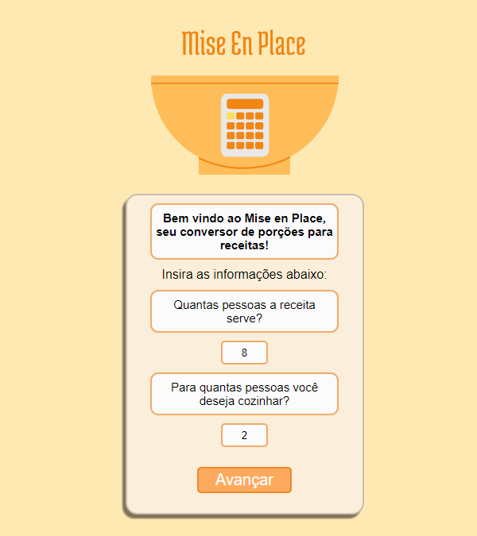
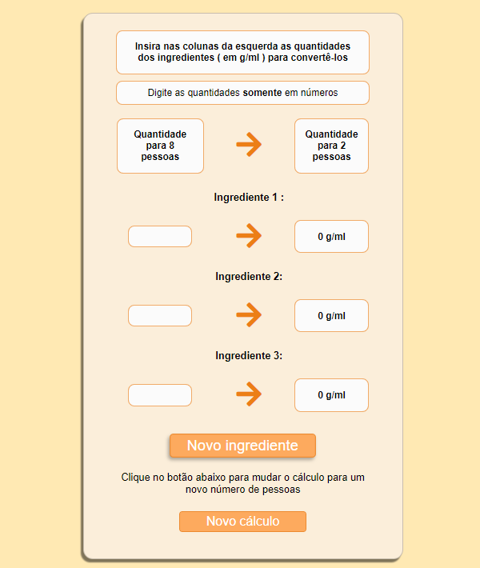

# Mise en Place

<h2>Bem vindos ao site Mise en Place, seu conversor de porções para receitas! </h2> 

## 📋 Um breve resumo do projeto:

O site foi desenvolvido visando estruturar uma aplicação dinâmica em JavaScript que facilitasse a conversão de porções de receitas para outras quantidades maiores ou menores.

## 👨‍💻 Linguagens e ferramentas utilizadas:

- Figma
- HTML 5
- CSS3
- JavaScript

## 📲 Dispositivos homologados:

O site opera nas seguintes dimensões de telas:

- 1280px
- 1024px
- 780px
- 425px
- 375px

## 💻 Funcionalidades:

- [x] Campos para captura de valores para conversão
- [x] Cálculo em tempo real dos valores
- [x] Botão de "Novo ingrediente" para adicionar uma nova linha de conversão
- [x] Botão de "Novo cálculo" para resetar os cards e reiniciar as conversões

## 🤝 Colaboradores:

<table>
  <tr>
    <td align="center">
      <a href="#">
         
        
          <b>Gabriel R. Rodrigues</b>
        
      </a>
    </td>
    <td align="center">
      <a href="#">
         
        
          <b>Vitor Macedo</b>
        
      </a>
    </td>
  </tr>
</table>
